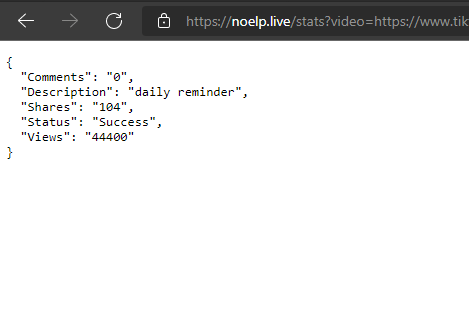

<br/>
<p align="center">
  <a href="https://github.com/Noelistired/TikTok-ReAPI">
    
  </a>

  <h3 align="center">TikTok API (Unofficial)</h3>

  <p align="center">
    Wraps the basic statistic api into a easy to use RestAPI
    <br/>
    <br/>
    <a href="https://github.com/Noelistired/TikTok-ReAPI"><strong>Explore the docs »</strong></a>
    <br/>
    <br/>
    <a href="https://github.com/Noelistired/TikTok-ReAPI">View Demo</a>
    .
    <a href="https://github.com/Noelistired/TikTok-ReAPI/issues">Report Bug</a>
    .
    <a href="https://github.com/Noelistired/TikTok-ReAPI/issues">Request Feature</a>
  </p>
</p>

 

## Table Of Contents

* [About the Project](#about-the-project)
* [Built With](#built-with)
* [Getting Started](#getting-started)
  * [Prerequisites](#prerequisites)
  * [Installation](#installation)
* [Usage](#usage)
* [Roadmap](#roadmap)
* [Contributing](#contributing)
* [License](#license)
* [Authors](#authors)
* [Acknowledgements](#acknowledgements)

## About The Project



There are many great TikTok API Wrappers available on GitHub, however, I didn't find one that really suit my needs for NoelP X AIO. (https://youtube.com/noelp) so I created this easy to use yet advanced one. This api is so amazing that it'll be the last one you ever need.

Here's why:

* Self-Hosted
* No Ratelimits
* Dedicated Developers :smile:

Of course, no api will serve all needs since your needs may be different. So I'll be adding more in the near future.

## Built With

This API is fully made (and maintained) using Python. With the FLASK module

## Getting Started

This is an example of how you may give instructions on setting up your project locally.
To get a local copy up and running follow these simple example steps.

### Prerequisites

This is an example of how to list things you need to use the software and how to install them.

* Python
```sh
pip install requests
```

### Installation

This RestAPI only allows GET requests.
response = requests.get("https://noelp.live/stats?video=
*https://www.tiktok.com/@noelp_/video/7080105292943363333?is_copy_url=1&is_from_webapp=v1*")

## Usage

https://noelp.live/stats?video=
*https://www.tiktok.com/@noelp_/video/7080105292943363333?is_copy_url=1&is_from_webapp=v1*space. You may also link to more resources.

_For more examples, please refer to the [Documentation](https://example.com)_

## Roadmap

See the [open issues](https://github.com/Noelistired/TikTok-ReAPI/issues) for a list of proposed features (and known issues).

## Contributing

Contributions are what make the open source community such an amazing place to be learn, inspire, and create. Any contributions you make are **greatly appreciated**.
* If you have suggestions for adding or removing projects, feel free to [open an issue](https://github.com/Noelistired/TikTok-ReAPI/issues/new) to discuss it, or directly create a pull request after you edit the *README.md* file with necessary changes.
* Please make sure you check your spelling and grammar.
* Create individual PR for each suggestion.
* Please also read through the [Code Of Conduct](https://github.com/Noelistired/TikTok-ReAPI/blob/main/CODE_OF_CONDUCT.md) before posting your first idea as well.

### Creating A Pull Request

1. Go to https://noelp.live/
2. Message NoelP
3. Commit your Changes (`git commit -m 'Add some AmazingFeature'`)
4. Push to the Branch (`git push origin feature/AmazingFeature`)
5. Open a Pull Request

## License

Distributed under the MIT License. See [LICENSE](https://github.com/Noelistired/TikTok-ReAPI/blob/main/LICENSE.md) for more information.

## Authors

* **NoelP** - *Creation and Maintence of API* - [NoelP](https://github.com/NoelisTired/) - **
* **Solarity** - *Set up Flask* - [Solarity](https://github.com/SolarityPY/) - **

## Acknowledgements

* [YouTube](https://youtube.com/noelp)
* [Website](https://noelp.live/)
* [Discord](https://noelp.live/)
